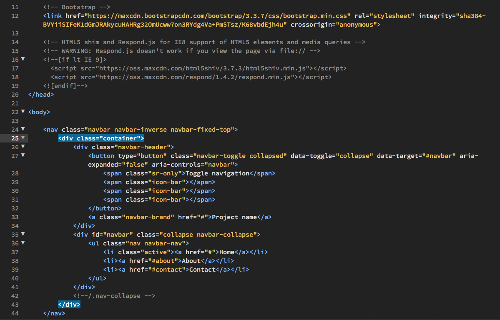
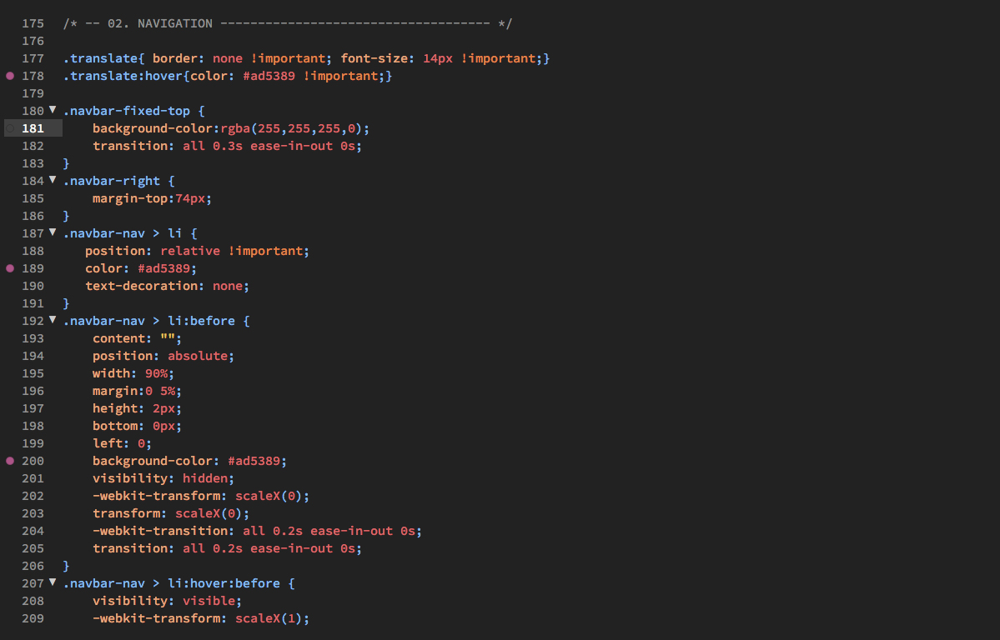
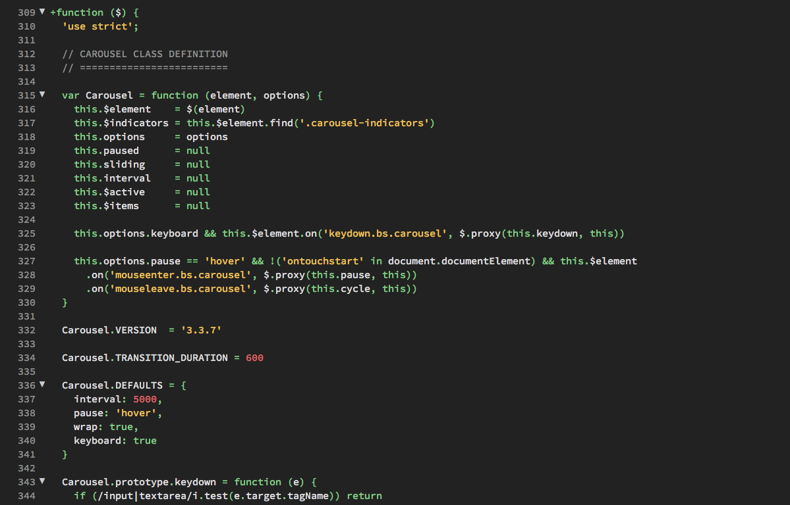
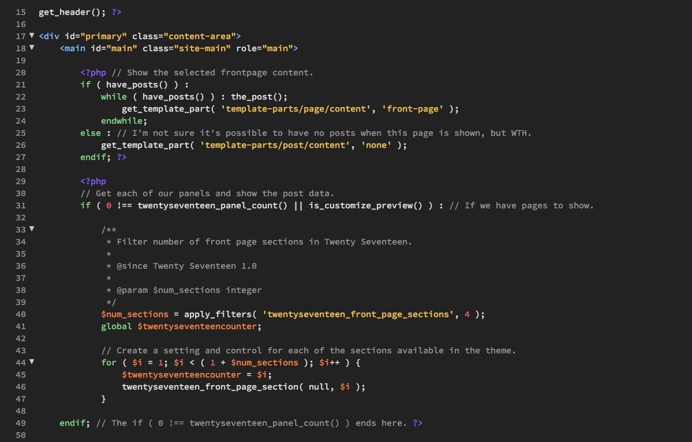

# Raven Theme for Brackets

Dark color scheme based on Dreamweaver CC's Raven theme. Now with better preprocessor support.

## Installation
* Open Brackets
* Open the Extension Manager
* Switch to "Themes" tab
* Search for "Raven"
* Click "Install"

## HTML

## CSS

## JavaScript

## PHP

## Copyright and License
Copyright (c) 2017 [JTruax](https://github.com/JTruax). Released under the [MIT License](LICENSE).
